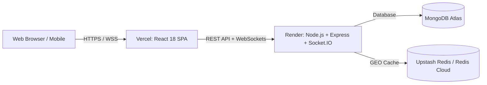

# 🚀 RouteX Full-Stack Cloud Deployment Guide

This guide walks you through deploying the complete **RouteX** distributed mobility system to free-tier cloud providers in under 10 minutes.

---

## 🏗️ Architecture Overview



---

## 🗄️ Step 1: Set Up Free Cloud MongoDB (MongoDB Atlas)

1. Go to **[MongoDB Atlas](https://www.mongodb.com/cloud/atlas)** and sign in / sign up.
2. Click **Create Cluster** and select the **M0 Free** tier.
3. Under **Security → Database Access**, create a user (e.g., username `routex_user`, secure password).
4. Under **Security → Network Access**, add IP Address `0.0.0.0/0` (Allow Access from Anywhere).
5. Go to **Deployment → Database**, click **Connect → Drivers (Node.js)**, and copy your connection string:
   ```text
   mongodb+srv://routex_user:<password>@cluster0.abcde.mongodb.net/routex?retryWrites=true&w=majority
   ```

---

## ⚡ Step 2: (Optional) Set Up Cloud Redis (Upstash)

*RouteX operates seamlessly even without Redis via its built-in MongoDB fallback, but Redis gives sub-millisecond GEO matching.*

1. Go to **[Upstash](https://upstash.com/)** and create a free Redis database.
2. Under the database details, copy the **`rediss://...`** connection URL.

---

## 🖥️ Step 3: Deploy Backend on Render

1. Go to **[Render](https://render.com/)** and sign in with GitHub.
2. Click **New + → Web Service**.
3. Select your repository: `pardhuva/RouteX`.
4. Configure the service settings:
   - **Name:** `routex-backend`
   - **Root Directory:** `server`
   - **Environment:** `Node`
   - **Build Command:** `npm install`
   - **Start Command:** `node src/server.js` (or `npm start`)
   - **Instance Type:** `Free`
5. Under **Environment Variables**, add:
   | Key | Value |
   |---|---|
   | `PORT` | `5050` (or leave default assigned by Render) |
   | `NODE_ENV` | `production` |
   | `MONGO_URI` | `mongodb+srv://...` (from Step 1) |
   | `JWT_SECRET` | `your_super_secret_jwt_key_here` |
   | `JWT_EXPIRES_IN` | `7d` |
   | `DRIVER_SEARCH_RADIUS_METERS` | `25000` |
   | `REDIS_URL` | *(your Upstash Redis URL or leave blank)* |
6. Click **Create Web Service**.
7. Once deployed, copy your Render backend URL (e.g., `https://routex-backend.onrender.com`).

*(Optional: Run driver seed script once from the Render Shell tab: `node scripts/seedDrivers.js`)*

---

## 🌐 Step 4: Deploy Frontend on Vercel

1. Go to **[Vercel](https://vercel.com/)** and sign in with GitHub.
2. Click **Add New... → Project**.
3. Import your `pardhuva/RouteX` repository.
4. In the project configuration:
   - **Framework Preset:** `Vite`
   - **Root Directory:** Click **Edit** and select `client`
5. Under **Environment Variables**, add:
   | Key | Value |
   |---|---|
   | `VITE_API_URL` | `https://routex-backend.onrender.com/api` |
   | `VITE_SOCKET_URL` | `https://routex-backend.onrender.com` |
6. Click **Deploy**.
7. In ~30 seconds, your frontend will be live on `https://routex-xxx.vercel.app`!

---

## ✅ Step 5: Verification Checklist

1. Open your live Vercel URL in your browser.
2. Register a new Rider account.
3. Open an Incognito window or another browser tab and register a Driver account.
4. Request a ride as a rider and observe real-time matching and status updates!
