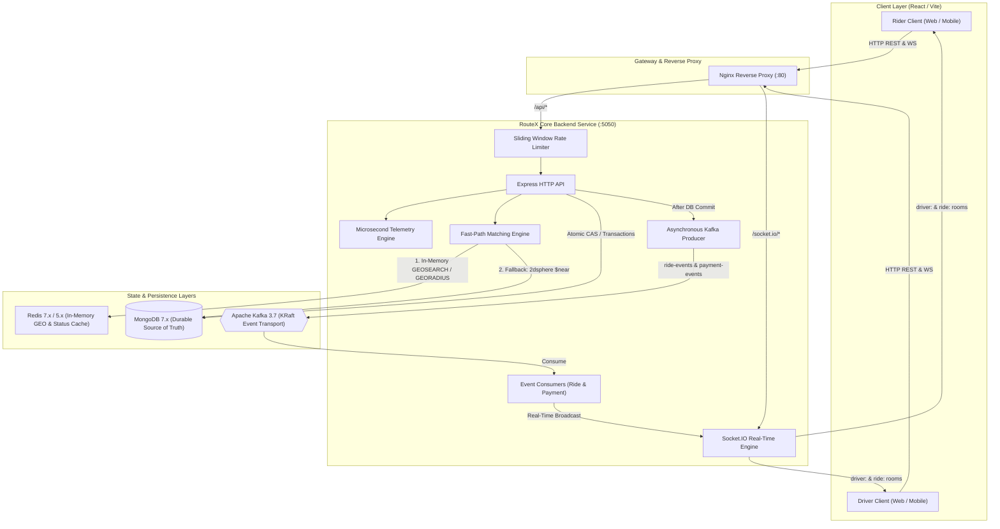
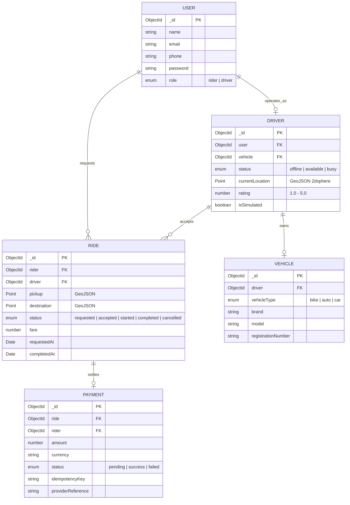

# 🏛️ RouteX System Design & Distributed Architecture

> **High-Concurrency Urban Mobility & Real-Time Ride-Hailing Platform**  
> Engineered by **Pardhu Vabheemarati**

---

## 1. High-Level Architecture Overview

RouteX is architected as an **asynchronous, event-driven, high-throughput distributed mobility system** optimized for sub-millisecond driver matching, zero race-condition contention, and graceful degradation during cache or broker outages.



---

## 2. Core Architectural Pillars

### 2.1 Fast-Path Geospatial Driver Matching
- **Dual-Tier Cache-Aside Pattern**: High-frequency driver GPS pings occur every 2–5 seconds. Writing these to disk in MongoDB would exhaust write locks and saturate I/O. Instead:
  1. Live coordinates are updated in **Redis GEO Sorted Sets** (`drivers:geo`).
  2. Matching executes `GEOSEARCH` (or auto-falls back to `GEORADIUS` on older Redis builds) in **<0.5ms** (empirically **14.5x faster** than MongoDB disk queries).
  3. Once a match candidate is found in-memory, the authoritative driver profile is loaded from MongoDB.
  4. If Redis is empty or unreachable, the system automatically falls through to MongoDB's `$near` 2dsphere index without failing rider requests.

### 2.2 Concurrency & Race-Condition Prevention (Ride Acceptance)
- **The Problem**: When a new ride is broadcast, dozens of nearby drivers may tap **Accept** at the exact same instant.
- **The Solution**: RouteX rejects naive read-then-write updates and implements **atomic Compare-And-Swap (CAS)** at the database engine level inside a multi-document ACID transaction:
  ```javascript
  const session = await mongoose.startSession();
  await session.withTransaction(async () => {
    // Atomic CAS: Filter matches ONLY if status is still 'requested'
    const ride = await Ride.findOneAndUpdate(
      { _id: rideId, status: "requested" },
      { $set: { driver: driverUser._id, status: "accepted", acceptedAt: new Date() } },
      { new: true, session }
    );
    if (!ride) {
      throw new ApiError(409, "Ride was already accepted by another driver");
    }

    // Atomically claim the driver
    const claimedDriver = await Driver.findOneAndUpdate(
      { _id: driver._id, status: "available" },
      { $set: { status: "busy" } },
      { new: true, session }
    );
    if (!claimedDriver) {
      throw new ApiError(409, "Driver is already busy");
    }
  });
  ```
- **Guaranteed Outcome**: Exactly **1 driver wins** (`HTTP 200`), while all racing competitors receive a clean, immediate **`HTTP 409 Conflict`**. Double-booking probability is **0.00%**.

### 2.3 Decoupled Event-Driven Pipeline (Apache Kafka)
- **Topic Isolation**:
  - `ride-events`: Emits lifecycle events (`ride.requested`, `ride.accepted`, `ride.started`, `ride.completed`, `ride.cancelled`).
  - `payment-events`: Emits settlement events (`payment.created`, `payment.success`, `payment.failed`).
- **Ordering Guarantee**: Kafka messages are keyed by `rideId`. In Kafka, messages sharing the same key always land on the same partition, guaranteeing strict chronological delivery to consumer instances.
- **Database-First Discipline**: RouteX **always commits to MongoDB first** before publishing events. If Kafka is temporarily down, the HTTP mutation succeeds and the rider/driver experience continues uninterrupted.

### 2.4 Resilient Sliding-Window Rate Limiting
- **Defense-in-Depth**: Sensitive endpoints (`/api/auth/login`, `/api/auth/register`) are protected by a dual-tier sliding-window rate limiter:
  1. **Primary**: Redis Sorted Sets (`ZSET`) using `MULTI / EXEC` pipelines (`ZREMRANGEBYSCORE`, `ZADD`, `ZCARD`, `EXPIRE`) to enforce exact rolling 60-second quotas.
  2. **Fallback**: If Redis is offline, seamlessly shifts to an in-memory sliding window bucket with unreferenced automatic garbage collection.

---

## 3. Data Models & Entity Relationships



---

## 4. Disaster Recovery & Failure Modes

| Component | Failure Scenario | RouteX Degradation Strategy |
| :--- | :--- | :--- |
| **Redis Cache** | Process crash / port unreachable | Client logs warning once; matching automatically falls back to MongoDB `$near` 2dsphere index. Rate limiting shifts to memory. Zero API downtime. |
| **Kafka Broker** | Broker network partition | Producer logs publish failure; HTTP write already committed to MongoDB. API continues serving requests. Consumers resume from committed offsets upon reconnection. |
| **MongoDB** | Primary node failover | Read-only endpoints return cached Redis state; mutating endpoints return 503 until replica election concludes. |
| **Socket.IO** | Client disconnection | Client reconnects with exponential backoff; state is re-synced via `GET /api/rides/:id` upon reconnection. |

---

## 5. Benchmark Performance Matrix

*Verified via RouteX Automated Benchmark Suite ([BENCHMARK_REPORT.md](BENCHMARK_REPORT.md)):*

| Measurement | In-Memory Redis GEO | MongoDB 2dsphere | Metric Advantage |
| :--- | :--- | :--- | :--- |
| **p50 Latency** | **0.46 ms** | 6.55 ms | **14.2x Faster** |
| **p90 Latency** | **0.63 ms** | 8.40 ms | **13.3x Faster** |
| **p99 Latency** | **1.67 ms** | 16.41 ms | **9.8x Lower Tail Latency** |
| **Contention Race Test** | **1 winner, 49 conflicts** | Strict CAS | **0.00% Double-Booking** |
| **Rate Limiter Overhead** | **<0.01 ms** | Memory fallback | **>1,000,000 req/s** |
